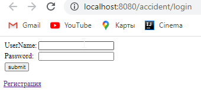
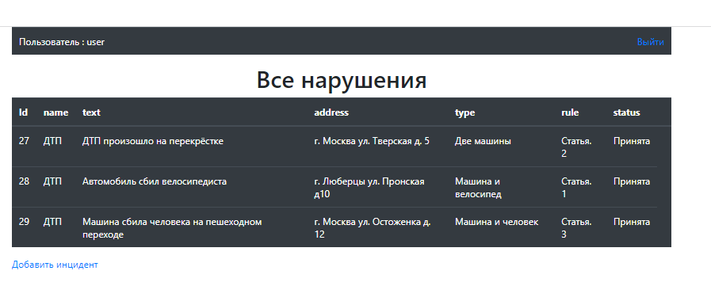

# Car_accident (Автонарушители).
Car_accident - это Web проект, которые позволяет заносить информацию о нарушениях, в системе существует две роли - обычные пользователи и автоинспекторы. 
Данный проект разрабатывался на основе следующих модулей Spring:    
1) Spring Core Container (Beans, Core, Context, SpEl);  
2) Spring Data (JDBC, ORM); 
3) Spring Web (Servlet, Web);   
4) Spring Test; 
5) Spring Security.  

В проекте настроена система фильтрации, для того чтобы попасть на стартовую страницу, необходимо пройти систему регистрации.    
  
Пользователи добавляют автонарушения.   
     
В заявлении указывает: название, описание, адрес, тип нарушения (участники нарушения), статья нарушения.    
У заявки есть статус. Принята. Отклонена. Завершена.    
        
Инспекторам позволяется видеть все заявки и изменять.   
.png)       
Изменение заявки осуществляется через заполнение формы.     
     

Кроме Spring в ходе разработки проекта использовались следующие инструменты:
   * java
   * servlets
   * postgresql
   * js
   * ajax
   * jquery
   * bootstrap
   * mockito
   * jstl
   * jsp
   * hibernate
   * maven
   * liquibase
   * junit